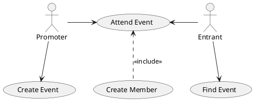

# study_vuejs

## 目的

.NetMVC,SpringMVC,Rails そのほかもろもろでVue.JSを使ってみたいので

本家や以下サイトを参考に学習

<https://k-miyake.github.io/blog/vue-ko-aspnet/>

<https://qiita.com/asip2k25/items/bd4bdccd5201d542953c>

## そのほか

GitHubのプロジェクト機能でプロジェクト管理してみようかな

GitLab も使うのでＰｌａｎｔＵＭＬの練習

